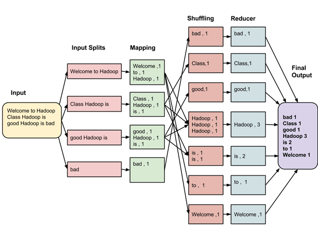
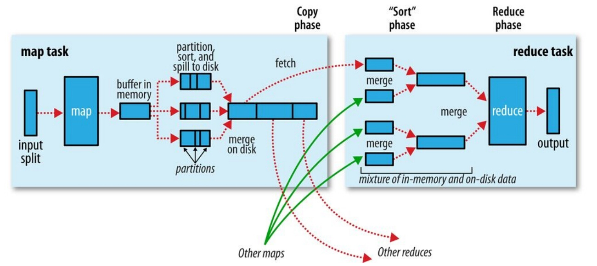
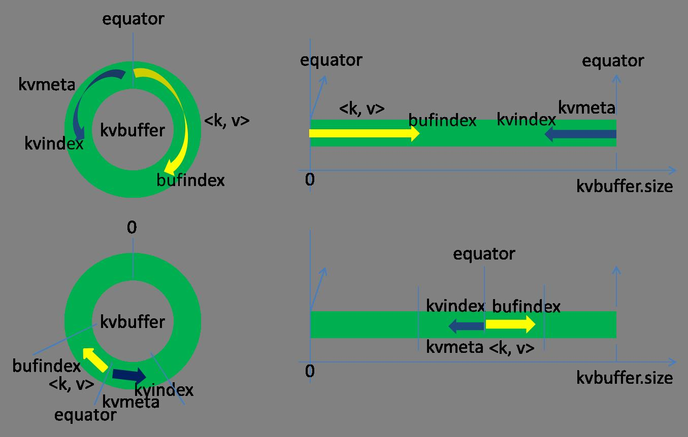
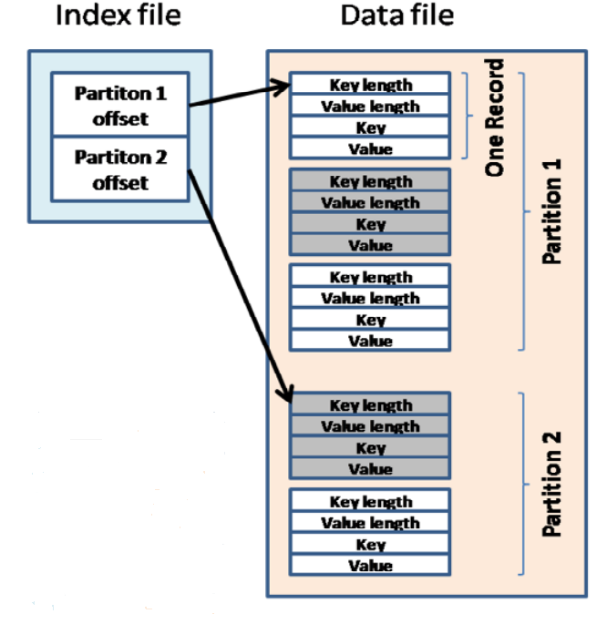

# Hadoop

[An Introduction to Apache Hadoop](https://opensource.com/life/14/8/intro-apache-hadoop-big-data)
[Hadoop Python MapReduce Tutorial for Beginners](https://blog.matthewrathbone.com/2013/11/17/python-map-reduce-on-hadoop-a-beginners-tutorial.html)

## Terminology
### NameNode
The NameNode is the centerpiece of an HDFS file system. It keeps the **directory tree** of all files in the file system, and tracks where across the cluster the file data is kept. It does not store the data of these files itself.

### Commodity Hardware
The Hadoop Distributed File System (HDFS) is a distributed file system designed to run on hardware based on **open standards** or what is called **commodity hardware**. This means the system is capable of running different operating systems (OSes) such as Windows or Linux without requiring special drivers.

### Rack
A Rack is **a collection nodes** usually in 10 of nodes which are closely stored together and all nodes are connected to **a same Switch**. When an user requests for a read/write in a large cluster of Hadoop in order to improve traffic the namenode chooses a datanode that is closer this is called **Rack Awareness**.

### 什么是Yarn
Yarn是一个资源调度平台。我们将一批机器组成一个资源池供大家共同使用，这样一来闲置的资源就可以共享给其他人使用，增加资源的使用效率。同时，我们也存在一些隔离机制，使得已经申请使用的资源保证能够分配给用户使用。

关于Yarn的更多信息，可以参考开源项目网站：http://hadoop.apache.org/docs/current/hadoop-yarn/hadoop-yarn-site/YARN.html

### Yarn和HDFS的关系
Yarn和HDFS共同属于Hadoop开源项目，两者相互协作完成任务调度和执行的功能。HDFS是一个分布式文件存储系统，用户要提交的任务首先打包上传到HDFS系统中，然后再由Yarn进行调度。Yarn将任务调度到某台具体的机器上，在该机器上从HDFS下载打包的用户任务，然后再执行任务。

### Yarn和MapReduce/Spark/Flink的关系
MapReduce/Spark/Flink均为分布式计算框架，是一个抽象层用于帮助用户编写分布式计算程序。编写好的分布式计算程序需要运行在某个能够提供计算资源的平台上，Yarn就是这样的一个平台。同类的平台还有Mesos和Kubernetes。

### 资源组
Resource Group（资源组），是一个虚拟的组，也是HDFS Quota审计和成本审计的单位，目的是将组织架构上的Team和HDFS quota进行解耦，更加方便的用户的拆分，成本系统的对接，INodeQuota的上线，以及更加标准化，规范化的使用HDFS服务。

主要区别：
1. 将Team与HDFS quota解耦，用户不再直接对Team申请quota。
3. 一个Team可以有一个或多个资源组，一个用户可以处在多个资源组中。

### 队列
对于很豪的公司来说，每个用户(团队)自己有一个hadoop集群，这样可以提高自身的稳定性和资源供应，但是确降低了资源利用率，因为很多集群大多数时间都是空闲的。CapacityScheduler能实现这样的功能：每个组固定享有集群里的一部分资源，保证低保，同时如果这个固定的资源空闲，那么可以提供给其他组来抢占，但是一旦这些资源的固定使用者要用，那么立即释放给它使用。这种机制在实现上是通过queue（队列）来实现的。当然CapacityScheduler还支持子队列（sub-queue），

参数包括 CPU配额（低保线）、CPU上限、内存配额与上限、最大允许作业数，是否允许抢占等

## 配置环境
1. 先安装Java，再安装yarn_deploy部署库，安装hadoop
2. 申请加入资源组（HDFS）
3. 申请加入一个队列（YARN）
4. 提交任务

## MapReduce
MapReduce is a software framework for processing large datasets in a distributed fasion over a several machines. The core idea behind MapReduce is mapping your dataset into a collection of <key, value> pairs, and then reducing over all pairs with the same key.

Take **wordcount** as an example:

- The purpose of the map script is to model the data into <key, value> pairs for the reducer to aggregate. (text to <word, 1>)
- Emitted kv pairs are "shuffled" or grouped based on the keys. (groupby word)
- The reduce script takes a collection of kv pairs and reduce them. (sum over counts)

# 过程详解

## Mapper 端
输入数据被切分为多个split送入mapper中，mapper的输出叫做record，每个record进行序列化之后存入一个环形缓冲区中，序列化的record包含data与meta data部分，分别存进kv-buffer和accounting buffer中。

### Buffer in Memory
- Metadata：
  - buffer中key的位置
  - value的位置
  - value的长度
  - partition id
- Partition(segment):
  - 每个key都会通过一个partitioner分配一个partition id
  - 每个partition id 对应了一个 reducer
  - partition id = key % #Reducers，这就保证了相同的key会被分到同一个reducer中。

环形数据结构如下所示，kv-buffer与accounting-buffer 反向增加，二者任何一个达到容量比例(如80\%)时便启动写入disk进程。

### Partition，Sort，and Spill to Disk
首先需要在内存上进行排序，原则是1st key 为 partition id， 2nd key 是 key。排序后写入磁盘，数据存成spill001.data，索引存成spill001.index。

与此同时，写入磁盘并不影响mapper继续输出records，这里将巧妙地重置环形buffer的起点，按照比例分配index和data的空间，继续反向加入数据，实现了同步emit与spill。如果存在spill未结束而buffer空间耗尽的情况，则阻塞mapper。

### Merge on Disk
当一个mapper所有的records都被写入磁盘后，将会被merge成一个大的分区有序文件，以便于reducer通过HTTP请求对应partition数据时的快速读取。

## Reducer 端
### Copy
Reducer 通过HTTP端口获取每个 mapper output 对应属于自己的 partition 的数据。注意每个map任务的完成时间可能是不一样的，reduce任务在map任务结束之后会尽快取走输出结果，这个阶段叫copy。一旦map任务完成之后，就会通过常规心跳通知应用程序的Application Master。reduce的一个线程会周期性地向master询问，直到提取完所有数据。
### Merge
当所有map输出都拷贝完毕之后，所有数据被最后合并成一个排序的文件，作为reduce任务的输入。这个合并过程是一轮一轮进行的，最后一轮的合并结果直接推送给reduce作为输入，节省了磁盘操作的一个来回。
### Reduce
合并后的文件作为输入传递给Reducer，Reducer针对每个key及其排序的数据调用reduce函数。产生的reduce输出一般写入到HDFS，reduce输出的文件第一个副本写入到当前运行reduce的机器，其他副本选址原则按照常规的HDFS数据写入原则来进行。

### Map
- 一个record被一个map输出之后会进行序列化，data 与 metadata分别存储在serialization buffer和accounting buffer中。
- 任何一个buffer的容量达到阈值后，该buffer中的内容将会被排序并写入磁盘，在写入过程中mapper将同步进行emit。
- 如果buffer容量已满（写磁盘速度慢于加入buffer速度），则mapper阻塞。
- mapper运行结束后，所有buffer内容将会被清空，所有磁盘上的segments将会被merge成一个文件。

注意：
- 增加buffer size可以减少spill的次数，使得mapper运行速度更快。
- 增加buffer size同样会造成mapper可用内存减少。

| 参数                   | 描述                                             |
|------------------------|--------------------------------------------------|
| io.sort.mb             | serialization buffer 和 accounting buffer 总大小 |
| io.sort.record.percent | serialization size/accounting size，当record较小时可以增加此比例以减少spill次数             |
| io.sort.spill.percent  | 触发 buffer spill的阈值                          |

