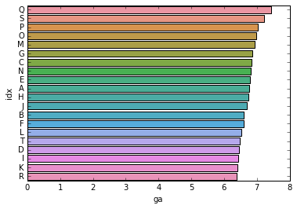
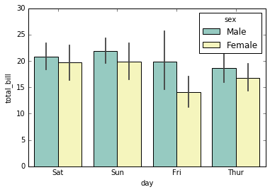
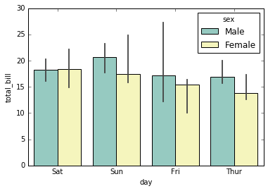
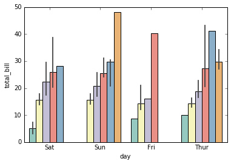
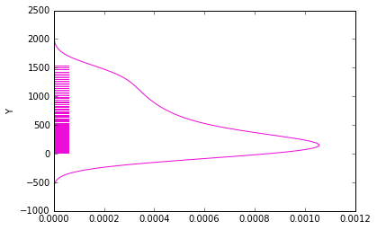
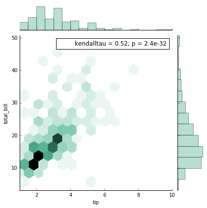

# Seaborn  

Seaborn 所有作图基于pandas.DataFrame,其dtypes对作图机制产生了很大的影响  

内置数据集请参阅 https://github.com/mwaskom/seaborn-data  

```python  
data = sns.load_dataset('dataset_name')
```

## 1.BarPlot  

假如我们通过numpy矩阵生成了一个DataFrame，却并没有指定其dtype  

```python 
df = pandas.DataFrame(data = data,columns=['value','name'])
```   

此时所有column的dtypes = object  

### 绘制一张横向直方图  

```python   
sns.barplot(data = df,x = 'value',y = 'name')
```

报错了！

``` TypeError: unsupported operand type(s) for /: 'str' and 'int' ```  

因为作图至少需要一个数字类型的column，而现在的object类型无法被比较大小  

```python
df['value'] = df['value'].astype('float64')  
df.sort_values('value',ascending = False) 
```

再次调用barplot画出如下图像  



### 其他attributes  

```python
sns.barplot(x='value',y='name',order=[ , , ],pallete = 'spring',estimator = median, hue='sex')
```

1.order 决定作图横坐标展示顺序  

  

2.estimator 根据何种量度确定直方图数值(如：中位数，平均数)  

  

3.hue 对比模式，若hue对应column中有k种元素，则分k列为一组表示  

  

4.color + saturation 调整纯色饱和度  

5.capsize 表示置信区间的I字形横杠的宽度

## Distplot  

```python  
sns.distplot(data['columns'],rug = True,hist = False,vertical = True,color = 'lavender')  
```  


rug:是否在底部显示数据分布 

hist:是否显示直方块  

vertical:横向or纵向（default：横向 False）  


## jointplot  

```python
sns.jointplot(x='tip',y='total_bill',data=tips,stat_func = your_func,kind = 'kde'，color='#4CB391') 
```  



1.stat_func 你自定义的函数  

2.kind 主图形式，默认为'scatter'散点图，'kde'为密度图，'hex'为蜂巢图，'reg'添加回归曲线, 'resid'为中心化  

3.color为颜色，rgb配色表参见 https://www.cnblogs.com/darkknightzh/p/6117528.html
