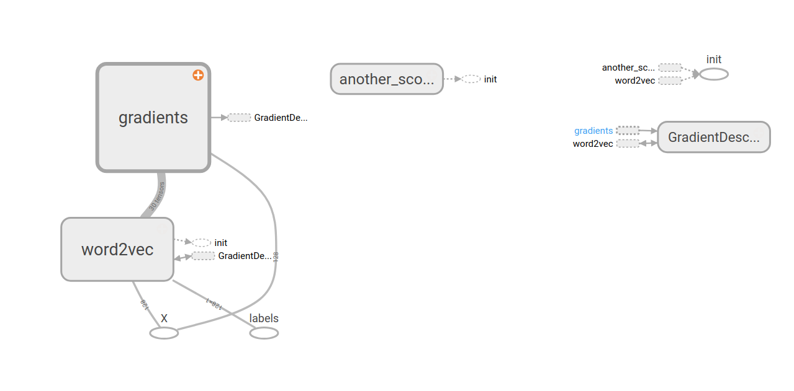

## Install
国内清华源不知为何conda update后tensorflow 仍是1.3.0版本，此时最新版已经是1.9.0了。
折腾半天换了conda-forge源后成功更新到1.8.0。
```shell
conda config --add channels conda-forge
conda update --all
```
一下更新了200多个包

## Graph
```python
a = tf.constant(3, dtype=tf.float32)
b = tf.constant(4.0)
total = a + b
with tf.Session() as sess:
    t = sess.run(total)
```
当使用 Session.run 请求输出节点时，TensorFlow会从该节点回溯整个图，并流经提供输出节点对应的输入值的所有节点。因此此指令会打印预期的值7.0

```python
t = sess.run({'ab':(a, b), 'total':total})
```
out: {'ab': (3.0, 4.0), 'total': 7.0}


## Tensorboard
真是一个强大的工具，不仅可以可视化计算图，还可以记录运行时节点数据信息，分布，统计，checkpoints.  
快速上手可视化graph
```python
with tf.Session() as sess:
    writer = tf.summary.FileWriter(path, sess.graph)
    ...
writer.close()
```
命令行输入：
```shell
tensorboard --logdir = path
```
打开浏览器localhost:6006端口即可



## tf.variable_scope
每一个scope就是一组节点的子图，如上方的word2vec, Gradient, another_scope。而scope之间通过节点的operation链接
```python
with tf.variable_scope("another_scope") as scope:
    ...
with tf.variable_scope("word2vec") as scope:
    ...
```
Scope的存在使得模型结构更加清晰

## 数学运算
### Tensor之间的运算规则
- 相同大小 Tensor 之间的任何算术运算都会将运算应用到元素级
- 不同大小 Tensor(要求dimension 0 必须相同) 之间的运算叫做广播(broadcasting)  
    - 如[64,5]与[64]、[64,]不可运算，与[64,1]可运算
- Tensor 与 Scalar(0维 tensor) 间的算术运算会将那个标量值传播到各个元素
- TensorFLow 在进行数学运算时，一定要求各个 Tensor 数据类型一致

```python

# 算术操作符：+ - * / % 
tf.add(x, y, name=None)        # 加法(支持 broadcasting)
tf.subtract(x, y, name=None)   # 减法
tf.multiply(x, y, name=None)   # 乘法
tf.divide(x, y, name=None)     # 浮点除法, 返回浮点数(python3 除法)
tf.mod(x, y, name=None)        # 取余
 
 
# 幂指对数操作符：^ ^2 ^0.5 e^ ln 
tf.pow(x, y, name=None)        # 幂次方
tf.square(x, name=None)        # 平方
tf.sqrt(x, name=None)          # 开根号，必须传入浮点数或复数
tf.exp(x, name=None)           # 计算 e 的次方
tf.log(x, name=None)           # 以 e 为底，必须传入浮点数或复数
 
 
# 取符号、负、倒数、绝对值、近似、两数中较大/小的
tf.negative(x, name=None)      # 取负(y = -x).
tf.sign(x, name=None)          # 返回 x 的符号
tf.reciprocal(x, name=None)    # 取倒数
tf.abs(x, name=None)           # 求绝对值
tf.round(x, name=None)         # 四舍五入
tf.ceil(x, name=None)          # 向上取整
tf.floor(x, name=None)         # 向下取整
tf.rint(x, name=None)          # 取最接近的整数 
tf.maximum(x, y, name=None)    # 返回两tensor中的最大值 (x > y ? x : y)
tf.minimum(x, y, name=None)    # 返回两tensor中的最小值 (x < y ? x : y)
 
 
# 三角函数和反三角函数
tf.cos(x, name=None)    
tf.sin(x, name=None)    
tf.tan(x, name=None)    
tf.acos(x, name=None)
tf.asin(x, name=None)
tf.atan(x, name=None)   
 
 
# 其它
tf.div(x, y, name=None)  # python 2.7 除法, x/y-->int or x/float(y)-->float
tf.truediv(x, y, name=None) # python 3 除法, x/y-->float
tf.floordiv(x, y, name=None)  # python 3 除法, x//y-->int
tf.realdiv(x, y, name=None)
tf.truncatediv(x, y, name=None)
tf.floor_div(x, y, name=None)
tf.truncatemod(x, y, name=None)
tf.floormod(x, y, name=None)
tf.cross(x, y, name=None)
tf.add_n(inputs, name=None)  # inputs: A list of Tensor objects, each with same shape and type
tf.squared_difference(x, y, name=None)
```


## 分布  
### 平均分布
```python
    tf.random_uniform(shape, minval=0, maxval=None, dtype) 
```
- shape为1d数组或list
- 生成[minval, maxval)的平均分布 

### 截断正态分布
```python
tf.truncated_normal(shape, mean=0.0, stddev=1.0, dtype=tf.float32)
```
- 去掉距离均值大于2倍标准差的值

## Embedding
>一个embedding是从离散对象（discrete objects, 比如：单词）到实数向量的一个映射。 
```python 
blue:  (0.01359, 0.00075997, 0.24608, ..., -0.2524, 1.0048, 0.06259)
blues:  (0.01396, 0.11887, -0.48963, ..., 0.033483, -0.10007, 0.1158)
orange:  (-0.24776, -0.12359, 0.20986, ..., 0.079717, 0.23865, -0.014213)
oranges:  (-0.35609, 0.21854, 0.080944, ..., -0.35413, 0.38511, -0.070976)
```
### tf.nn.embedding_lookup
```python
tf.nn.embedding_lookup(params, ids, partition_strategy='mod', name=None, validate_indices=True, max_norm=None)
```
- params: 完整的Embedding Tensor
- ids: 你需要查看的Embedding vector序号，通常以矩阵形式给出
- Return: A Tensor with the same type as the tensors in params.  
将返回的3d-array concate，可使用reshape方法
```python
tf.reshape(A, [-1, n_words * dim_embedding])
```

