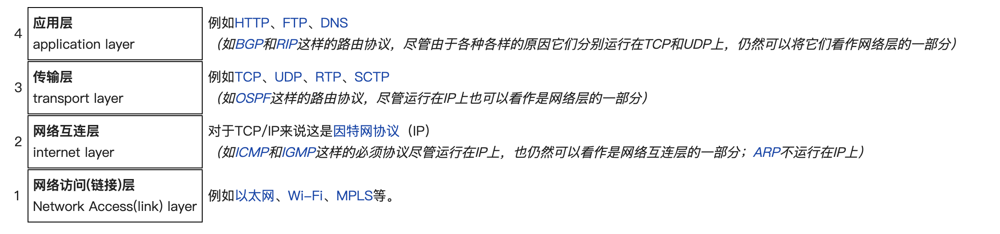
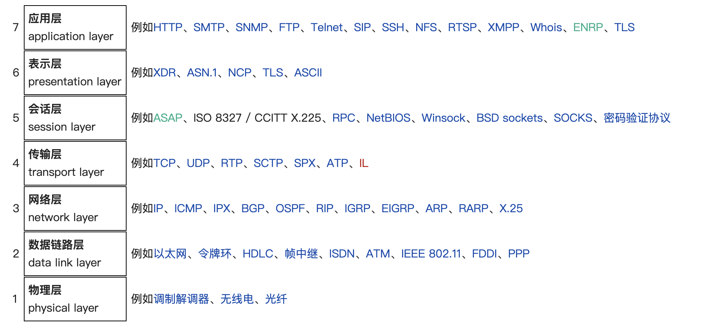

# Networking

"IP地址" 就是：Internet Protocol Address。翻译成中文就是：互联网协议地址 或者 网际协议地址。

1. 公有地址
- 公有地址（Public address）由Inter NIC（Internet Network Information Center因特网信息中心）负责。
- 这些IP地址分配给注册并向Inter NIC提出申请的组织机构, 通过它直接访问因特网。
  - A类 ：A类用于大型网络（能容纳网络126个，主机1677214台），A类保留给政府机构。
  - B类 ：B类用于中型网络（能容纳网络16384个，主机65534台），B类分配给中等规模的公司。
  - C类 ：C类用于小型网络（能容纳网络2097152个，主机254台），C类分配给任何需要的人。

2. 私有地址
- 私有地址（Private address）属于特地保留的非注册地址，专门为局域网内部使用。
- 这就是为什么我们在使用 ifconfig 时候看到的本机地址都是 192.168.xxx.xxx（在家） 和 172.16.xxx.xxx（在学校/公司）了。

3. 子网掩码（Subnet Mask）
- 子网掩码用于区别某个IP地址中哪部分为网络部分，哪部分为主机部分。
- 并非所有网络都需要子网，这意味着网络可使用默认子网掩码。
- 网络地址 = 子网掩码 & IP地址

|  类型   | 公有地址范围  | 私有地址 | 默认子网掩码 | 分配对象 |
|  ----  | ----  | ---- | ---- | ---- |
| A  | 1.0.0.0--126.255.255.255 |  10.0.0.0--10.255.255.255    |   255.0.0.0   |政府机构 |
| B  | 128.0.0.0--191.255.255.255 |  172.16.0.0--172.31.255.255    |  255.255.0.0    |中等规模的公司|
| C  | 192.0.0.0--223.255.255.255 |  192.168.0.0--192.168.255.255    |  255.255.255.0    |任何需要的人|

实际上我们个人电脑的地址为 **IP地址 = 网络地址+子网地址+主机地址**

# Case Study

假设电信公司给我们这栋楼分配的公网IP为117.158.134.217，为了使一整栋楼的人都能访问互联网，我们会对重新划分局域网。已知B类私有地址范围是：172.16.0.0~172.31.255.255，我们学校采取的就是这种划分方法，所以我的私网ip地址就是172.18.251.129.

那么公网地址是怎样分配给私有地址的呢？117开头的A类地址，又为什么可以使用B类的子网划分方式呢？这里就引出了NAT（Network Address Translation）网络地址转换技术。

## NAT
网络的私有地址本身是可路由的，只是公网上的路由器不会转发这三块私有地址的流量；当一个公司内部配置了这些私有地址后，内部的计算机在和外网通信时，公司的边界路由会通过NAT或者PAT技术，将内部的私有地址转换成外网IP，外部看到的源地址是公司边界路由转换过的公网IP地址。

1. 静态 NAT(Static NAT)（一对一）。
  - 将内部网络的私有IP地址转换为公有IP地址，IP地址对是一对一的，是一直不变的。

2. 动态地址 NAT(Pooled NAT)（多对多）。
  - 所有被授权访问Internet的私有IP地址可随机转换为任何指定合法的IP地址。

3. 网络地址端口转换NAPT（Network Address Port Translation）（Port-Level NAT）（多对一）。
  - 改变外出数据包的源端口并进行端口转换，采用端口多路复用方式。
  - 内部网络的所有主机均可共享一个合法外部IP地址实现对Internet的访问，可以最大限度地节约IP地址资源，同时也是IPv4能够维持到今天的最重要的原因之一。

可以看出使用只要私有地址存在于*NAT转换映射表*上就可以分配公网IP，A类地址采用B类子网划分也是可以的。

## NAT穿透
在互联网信息时代的今天，虽然现在宽带速度都很快，但对于电脑玩家来说，很大的问题是“没有公网 IP”！这使得想要在外访问家里的电脑、NAS、树莓派、摄像头等网络设备或远程控制等，都无法轻松实现。当目标计算机处于局域网内时，外网与该计算机需要连接通信，有时就会出现不支持内网穿透的障碍。

- 障碍一：位于局域网内的主机有两套 IP 地址，一套是局域网内的 IP 地址，通常是动态分配的，仅供局域网内的主机间通信使用；一套是经过网关转换后的外网 IP 地址，用于与外网程序进行通信。
- 障碍二：位于不同局域网内的两台主机，即使是知道了对方的 IP 地址和端口号，“一厢情愿”地将数据包发送过去，对方也是接收不到的。

解决办法：要想解决以上两大障碍，借助一台具有公网 IP 的服务器进行桥接即可。

## TCP/IP 四层参考模型

TCP/IP参考模型是一个抽象的分层模型，这个模型一共分为四层，所有的TCP/IP系列网络协议都被归类到4个抽象的“层”中。每一抽象层创建在低一层提供的服务上，并且为高一层提供服务。 完成一些特定的任务需要众多的协议协同工作，这些协议分布在参考模型的不同层中的，因此有时称它们为一个协议栈。

## OSI 七层参考模型

- 比较重要的HTTP、FTP、SSH在应用层
- RPC、SOCKS在会话层；
- TCP、UDP在传输层。

## TCP/IP 协议族
TCP/IP 是基于 TCP 和 IP 这两个最初的协议之上的不同的通信协议的大集合，而不是某一个特定的协议。

- TCP - 传输控制协议
    - TCP 用于从应用程序到网络的数据传输控制。
    - TCP 负责在数据传送之前将它们分割为 IP 包，然后在它们到达的时候将它们重组。
- IP - 网际协议（Internet Protocol）
    - IP 负责计算机之间的通信。
    - IP 负责在因特网上发送和接收数据包。

- HTTP - 超文本传输协议(Hyper Text Transfer Protocol)
    - HTTP 负责 web 服务器与 web 浏览器之间的通信。
    - HTTP 用于从 web 客户端（浏览器）向 web 服务器发送请求，并从 web 服务器向 web 客户端返回内容（网页）。

- HTTPS - 安全的 HTTP（HTTP Secure）
    - HTTPS 负责在 web 服务器和 web 浏览器之间的安全通信。
    - 作为有代表性的应用，HTTPS 会用于处理信用卡交易和其他的敏感数据。
- IMAP - 因特网消息访问协议（Internet Message Access Protocol）
    - IMAP 用于存储和取回电子邮件。
- POP - 邮局协议（Post Office Protocol）
    - POP 用于从电子邮件服务器向个人电脑下载电子邮件。

## 参考资料
1. [详解公网Ip和私网ip、ABC类IP地址](https://blog.csdn.net/gui951753/article/details/79210535)
2. [详解NAT网络地址转换](https://blog.csdn.net/freeking101/article/details/77962312)
3. [为什么需要内网穿透以及内网穿透的定义和应用](http://www.weather.com.cn/sstnews/2019/12/3270925.shtml)
