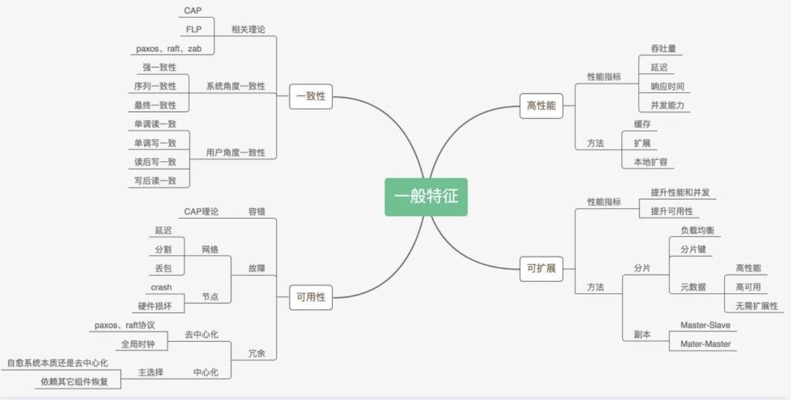

# Distributed System

## Major Topics
- 高性能（Performance）
- 可扩展（Scalability）
  - handle a growing amount of work by adding resources to the system.
- 容错性（Fault Tolerance）
  - Availability：即便某些节点fails，仍然可以继续 provide services
  - Recoverability：如果许多节点fails导致整个系统停止服务，仍然可以修复并保持正确性
- 一致性（Consistency）
  - Put/Get Operation
  - Strong Consistency：保证get到最新数据，节点间需要很多"chitchat"，需要 very heavy spec operation
  - Weak Consistency：不保证get到的是最新的数据
  - Different Copies：保持多个备份，地理上相互隔离防止同时crash

## MapReduce
### 目的
Google 在刚成立之初需要处理巨量数据，如给整个Web的网页进行indexing，那时互联网的整体数据量也有tens of Tyrabytes。当时的处理方式是雇佣大量有经验的SDE，人工设计在集群上的计算任务分配、收集、错误处理等等。然而这需要大量人力成本，如何能够使得不懂分布式原理的ordinary people也能使用集群进行计算呢？这就是MapReduce这一分布式计算框架诞生的需求。

### 读取数据
- MR运行在谷歌的GFS上
- 首先将输入数据进行分割，并不是随机进行分割，每个map任务将会 "smartly applied" 到每个split所存储的server上，所以几乎所有读取input split和写入map results操作都将会是local read/write，不需要进行网络传输。
- 然而由于Internet File System的进步，数据传输速度大大加速，现代MapReduce并不会local read/write了，而是分布式读取数据了。

## Timeline

- 1989: Paxos
- 2003: GFS 
- 2006: Chubby (One implementation of Paxos)
- 2010: ZooKeeper (One implementation of Paxos)
- 2013: Raft